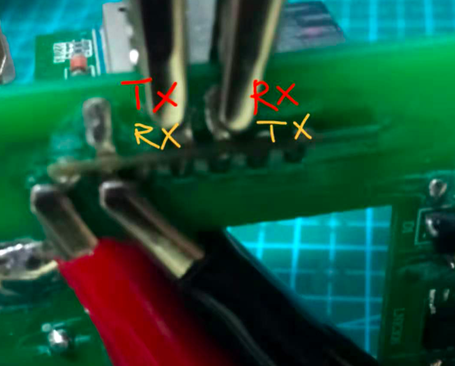

# MOPS 插座固件

MOPS插座，芯片为esp_wroom_02。出厂固件未知，目前配套APP尚不能使用。

因此，需要重刷固件。


## pin对应功能

| pin | 对应元件 | 触发方式 |
| :------------- | :----------: | :----------: |
|  15 | 继电器   | 高电平 |
| 12   | 状态灯 | 低电平 |
| 13   | 按钮 | 低电平 |


## esp_wroom_02 pinout

| pin | name |  | name | pin |
| :---- | :-----: | :----: | :----: | :----: |
|    | 3.3v |  | gnd |  | 
|    | en |  | io16 | 16 | 
|  14  |  io14  |  | A0 | A0 | 
|  12  |  io12  |  | rst |  |
|  13  |  io13  |  | scl | 5 |  
|  15  |  io15  |  | gnd |  | 
|  2  |  io2  |  | txd | 1 | 
|  0  |  io0  |  | rxd | 3 | 
|  ⭕️  |  gnd  |  | sda | 4 | 


注：上面红色圆圈与芯片中的圆点对应。

刷固件时，需让io0接地。然后如图，用鳄鱼夹刷固件。



红色文字的是USB转ttl的pin，黄色文字是板载pin。


刷完后，按钮可独立控制插座开关。也可输入url进行控制：

开：

```
curl --location --request POST '192.168.4.1:18650/api/status?power=off' \
--header 'Content-Type: application/x-www-form-urlencoded' \
--data-urlencode 'power=on'
```

关：

```
curl --location --request POST '192.168.4.1:18650/api/status?power=off' \
--header 'Content-Type: application/x-www-form-urlencoded' \
--data-urlencode 'power=off'
```

状态：

```
curl --location --request GET '192.168.4.1:18650/api/status'
```

OTA升级
http://192.168.4.1:18650/update